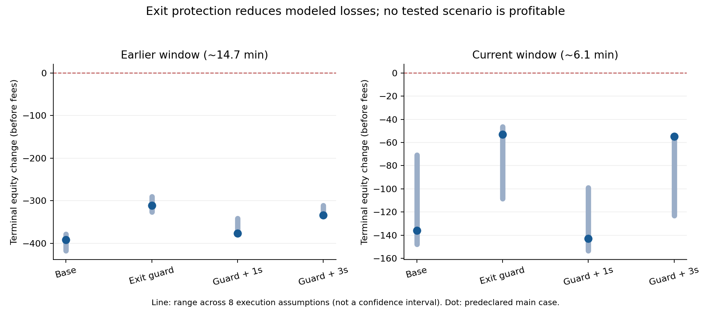

# B 减仓价格保护与超时：动态仓位回放

本轮结论：价格保护是有一致改善方向的候选，但仍不足以使 B 盈利。两段行情、八组成交假设下，价格保护相对原规则在 **16 / 16** 个对应比较中都少亏。六种规则总计 **96 个组合全部亏损**；不能把减少亏损解释为已经找到盈利策略。

按持仓年龄满 1 秒主动退出，相对仅做价格保护，在全部 16 个对应比较中更差。3 秒主动退出在 15 / 16 个比较中更差，仅有一组略好。这里比较的是完整模拟现金流和终点库存估值，原来的历史买入、卖出成交都没有作为必然发生的成交注入。

## 1. 当前约 6 分钟窗口的具体结果

主情景在运行前固定为：撤改单生效延迟 50 毫秒；同价成交先消耗入队时显示的前方数量；每侧盘口从最优价起先扣除 200 股，再只允许使用剩余数量的 50%。前两项模拟不确定的执行条件，后两项是主动成交深度的保守压力假设，不是对外部真实深度的精确识别。

| 规则 | 模拟盈亏，费用前 | 买卖总量 | 最大绝对持仓 | 时间平均绝对持仓 | 观察到的中间价权益回撤 | 超时主动退出量 |
|---|---:|---:|---:|---:|---:|---:|
| 原规则 | -135.9 | 566 | 8 | 1.038 | 139.2 | 0 |
| 减仓价格保护 | -53.0 | 500 | 8 | 1.324 | 59.3 | 0 |
| 价格保护 + 1 秒超时 | -143.0 | 550 | 6 | 0.687 | 144.8 | 175 |
| 价格保护 + 3 秒超时 | -54.9 | 506 | 8 | 1.061 | 60.7 | 54 |
| 原规则 + 1 秒超时 | -177.6 | 578 | 6 | 0.678 | 179.4 | 149 |
| 原规则 + 3 秒超时 | -144.5 | 578 | 8 | 0.974 | 147.8 | 24 |

本表六种情形最终都为空仓，因此表内盈亏等于模拟成交现金流，无终点未平仓估值影响。数字单位与原日志价格、现金一致。原策略真实记录为 −147.6、总量 628 股；模型原规则为 −135.9、总量 566 股，说明模型并没有精确复现实际成交。不能把 −53.0 说成修改策略后实际会赚到或亏掉的确定金额。

仅价格保护使交易总量从 566 降至 500，完整持仓回合从 124 降至 100，时间平均持仓从 1.038 增至 1.324 股；说明它改变了后续交易路径。最大仓位仍为 8 股。完整回合时长中位数由 1.153 秒变为 1.427 秒，亏损回合由 100 / 124 变为 63 / 100。它的改善没有依赖固定持有 15 或 45 秒。

1 秒超时减少了平均仓位，却带来 175 股主动退出。该情形相对仅价格保护多亏 90.0；这是整条模拟交易路径的差异，不能全部归因为这 175 股的直接成交费用或价差。

## 2. 结果对成交假设有多敏感

固定比较 2 种被动匹配方式 × 2 种延迟 × 2 种主动深度扣除方式：

- 被动成交：① 仅在公开主动成交穿过我方限价时匹配；② 在前方显示队列被同价成交耗尽后，也允许同价匹配。单次不超过该公开成交量和我方剩余数量。
- 撤改单延迟：50 或 250 毫秒。生效前旧单仍可成交；同价剩余单量合适时保留，不补回已成交数量。
- 主动深度：先扣除 0 或 200 股，每种都只使用剩余显示数量的一半，只扫原最优价附近 10 tick 内的档位。

| 北京时间窗口 | 规则 | 八组假设下的终点权益变化范围 | 相对同组原规则的改善范围 |
|---|---|---:|---:|
| 16:57—17:11 | 原规则 | -417.5 至 -378.7 | +0.0 至 +0.0 |
| 16:57—17:11 | 减仓价格保护 | -326.2 至 -290.2 | +76.7 至 +127.3 |
| 16:57—17:11 | 价格保护 + 1 秒超时 | -376.4 至 -341.3 | +15.0 至 +68.3 |
| 16:57—17:11 | 价格保护 + 3 秒超时 | -333.5 至 -311.4 | +50.9 至 +106.1 |
| 17:11—17:18 | 原规则 | -147.7 至 -70.7 | +0.0 至 +0.0 |
| 17:11—17:18 | 减仓价格保护 | -108.6 至 -46.5 | +24.2 至 +82.9 |
| 17:11—17:18 | 价格保护 + 1 秒超时 | -153.5 至 -99.1 | -33.7 至 +0.8 |
| 17:11—17:18 | 价格保护 + 3 秒超时 | -122.9 至 -53.7 | +2.0 至 +82.2 |

这些范围不是置信区间。两段行情来自同一天且都已用于探索，不能看作 16 份独立样本，也不是样本外验证。



## 3. 这次比上一轮多解决了什么

上一轮是固定历史成交后的“有没有到过价”分析。这次从空仓、零现金变化开始，在每个历史报价决策时刻，用模拟仓位重新计算中心偏移、买卖数量、周期风险衰减及增减仓保护。模拟成交来自公开成交记录或假设可用的即时盘口深度，成交后更新仓位和现金，影响下一次报价。

行情输入仍使用当时日志中的基础公允价、半价差、外部最优买卖价和当时周期信号；不读取未来信号。报价重建首先在历史原仓位上核对：v1 的 1541 次和 v2 的 655 次报价，共 2196 次，均复现原版本的买卖价格、单量、中心和周期风险偏移。正式情景比较统一使用当前 v2 的“不用周期移动报价中心”公式，前一段 v1 行情仅作为另一段历史输入，不把模拟原规则与 v1 的真实收益直接作因果比较。

两段回放均从空仓开始。前一段原日志继承 4 股，本实验没有继承；当前段原日志也从空仓开始。这进一步限制了前一段模拟与实际收益的直接可比性。

原规则、小仓位价格保护、各自加 1 秒或 3 秒超时，共六种规则。小仓位定义仍为 1—10 股、周期有效、非 reduce_only；只向外扩展减仓报价到中心至少 3 tick。大仓位沿用原减仓价格，未扫描边界找最优值。

**超时从本次持仓第一次离开零仓位计时**，加仓或部分平仓不重置；到下一个报价决策时检查，再计入执行延迟。超时取消两侧挂单、尝试主动平仓，深度不够则保留残仓并继续尝试，退出期间不新增挂单。它不是恰好到 1 秒一定成交的承诺，也不同于上一轮从“原退出时刻”往后看 1 秒。

## 4. 成交与风险约束

- 不根据空白 buyer/seller 推断对手身份；公开成交方向使用 aggressor_side。通过与自身真实 trade_id 关联，排除由自身主动发起的公开成交；自身被动成交对应的外部主动需求保留在固定需求流中。
- 同价前方队列只由同价成交量消耗，不假设撤单让自己提前成交。公开成交穿过限价时，按模型认为价格优先级足以到达我方；实际市场是否仍出现相同需求不可知。
- 新限价因延迟而变为可成交时，会尝试消耗剩余主动深度；剩余未成交量可继续挂单。同一盘口时间戳不补充已消耗深度；中间的公开成交还会扣减对应档位的历史剩余深度。
- 未假设被动减仓单在交易所具有原子 reduce-only 属性；其他成交改变仓位后，旧单可能越过零仓位，其现金流按真实方向记录。
- 仓位加全部未成交买单、仓位减全部未成交卖单分别检查 ±100，挂单总量检查 200。所有 96 个情景最大绝对持仓不超过 9 股；这不是其他行情下的风险上界。
- 时间相同的公开成交不匹配刚刚生效的订单；实际逐成交现金流、库存和空仓回合现金流分别核对。模拟成交包含部分成交和跨零成交。

## 5. 模型仍有什么不能证明

这是冻结历史信号和外部需求、动态更新仓位和报价的情景模型，并非完整交易所仿真。它没有重新拟合反事实订单簿中的周期、公允价，不能重建真实订单级队列，也未模拟市场参与者对我们改价后的反应。

同一版本的两侧撤换在假设延迟后原子生效；真实程序是顺序操作，且 A/B 共用速率限制。模型立即知道模拟成交，不包含真实成交回报延迟或网络拒单。因此模拟的风险控制和退出成功程度可能偏理想。

主动深度扣除 200 股用于覆盖自身订单与可用性不确定性，但不是精确扣除。新的盘口时间戳允许按该次观察刷新可用量；持续未补充的真实队列与我方市场冲击无法由快照唯一确定。被动匹配和主动扫单都依赖所声明的假设，范围不能视为收益上下界。

两段样本约 14.66 和 6.14 分钟，没有调参后新采集的验证期。当前行情 gzip 尾部截断，读取到完整 JSON 行后记录 EOF，没有补造尾部记录。当前段最后有效盘口时间与分析终点差约 0.218 秒；主情景当前段为空仓，不影响现金结果。其他情景保留的尾仓以最后有效中间价估值，逐情景记录 final_position 和 terminal_mark_age，未假装平仓。前一段终点标记年龄约 1.561 秒。

主表按费用前现金变化报告；metrics.json 另给每交易股 0、0.01、0.05 的假设费用敏感性，参数不是已核实的交易所费率，未计入残仓将来平仓费用。本次不连接交易所查询或执行任何交易。

## 6. 对下一步研究的取舍

保留小仓位减仓价格保护作为研究候选；不把 1 秒持仓年龄强平纳入候选默认值。3 秒强平虽减少部分持仓时间，在本样本也没有相对单纯保护表现出一致收益优势，不能凭上轮高到价率就加上固定超时。

更值得处理的是保护后仍存在的亏损：需要验证入场估值和短期报价更新是否有可靠优势，并把大仓位、行情失效与持仓风险触发的退出和常态小仓位退出分开评估。当前结果不足以增加 B 的交易规模，也不足以声称换上本规则即可盈利。

## 复现和验证

```text
python -m unittest discover -s analysis/b_dynamic_exit_20260910 -p test_replay.py
python analysis/b_dynamic_exit_20260910/study.py
python analysis/b_dynamic_exit_20260910/summarize.py
```

12 项测试通过，覆盖队列耗尽、穿价与触价、主动自身成交排除、生效时间、重复与过期盘口、撤单延迟、部分退出、跨零持仓、挂单保留、风险容量，以及后续定价实验的估值替换和单侧增仓加宽。2196 次历史报价重建全部通过；96 个情景核对逐成交现金与持仓，主情景额外用落盘明细独立重算仓位、现金和回合盈亏。

本次只新增 analysis/b_dynamic_exit_20260910 中的研究代码与结果。运行前后核对策略与执行器文件哈希相同。metrics.json 保存来源哈希和情景参数，summary.json 保存跨情景比较，主情景另保存逐报价、成交、回合和权益明细。
