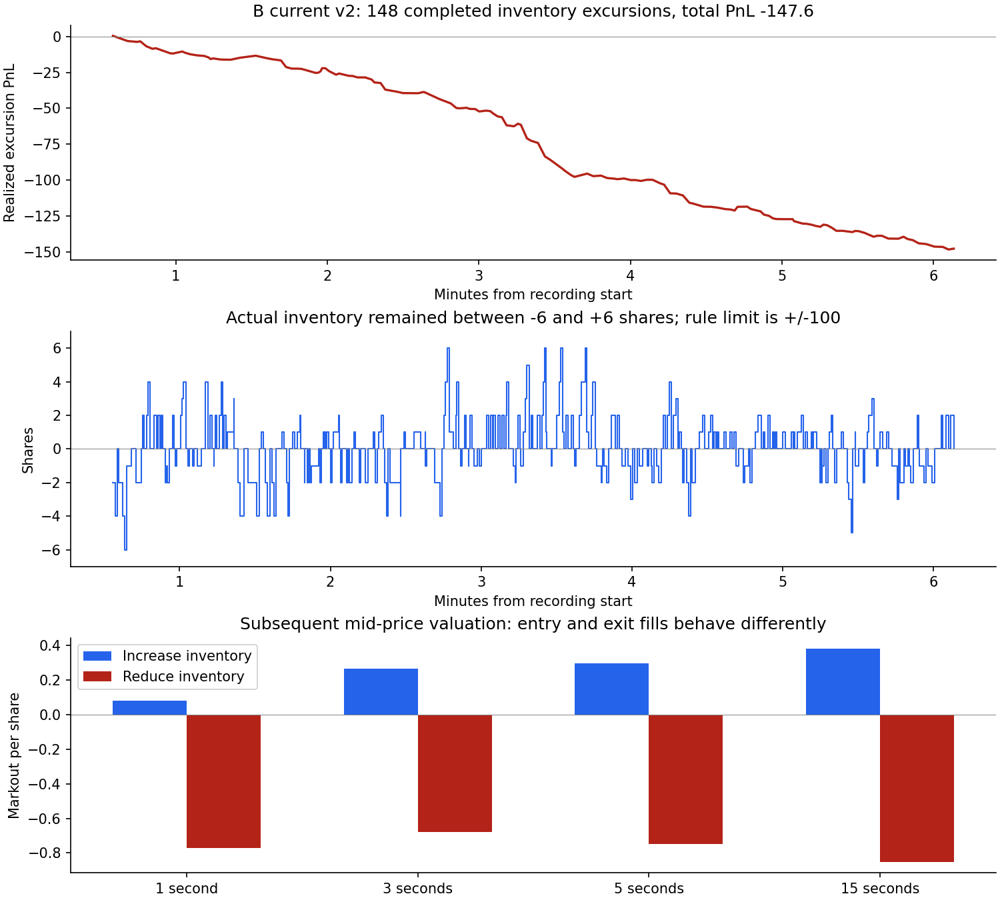

# B 策略亏损成交拆解

最值得优先检验的是小仓位减仓的定价：当前版本增仓成交的后续估值平均为正，减仓成交明显为负，且大量仓位在不到一秒内完成亏损回转。原始成交证明当前窗口的实际净亏为 147.6，持仓最高只有 6 股。这段亏损不能解释为触及 100 股上限后的被迫清仓。

## 范围与核对

主要分析 `baseline_cycle_risk_only_v2`，北京时间 2026-09-10 17:11:54—17:18:03，约 6.14 分钟。B 起始和最终均为空仓，共 365 笔成交，买入和卖出各 314 股。按成交现金流计算为 -147.6，与起终快照现金差、中间价权益差一致。因此这是该记录窗口内已结束交易的损失，不是未平仓的浮动估值；未额外计入日志未记录的费用，也不代表整个账户的损益。

日志没有 session_end，分析截至最后可见快照，不假定之后发生了什么。另分析三份同日旧版本 B 日志作为对照，不将它们混为当前版本，也不将不同时段差异解释为版本改动的因果效果。

每笔成交按交易所成交时间、成交 ID 排序，从初始持仓重建成交前后库存，区分增加绝对仓位与减少绝对仓位。跨过零仓位的成交拆成两部分，所以按类别统计的笔数可能相加超过原始 365 笔，成交数量不重复。订单通过真实 order_id 关联原始提交前报价，要求报价时间早于实际成交；当前全部 365 笔均有对应报价。

周期阶段采用原始报价当时的预测，不利用未来价格定义上涨、下跌。代码中的 `predicted_B_change` 实际是以 A 为参考的相对变化，文中“顺周期”“逆周期”均指成交方向与这一相对预测同向或反向，不把它当成 B 绝对价格的确定预测。

## 1. 真实亏损来自频繁的小仓位回转

把从 0 仓位开始、再次回到 0 的过程定义为一个完整回合：

| 当前 B 指标 | 结果 |
|---|---:|
| 完整回合数 | 148 |
| 盈利 / 亏损 / 持平回合 | 27 / 113 / 8 |
| 完整回合现金流合计 | -147.6 |
| 回合持仓时长中位数 | 0.853 秒 |
| 回合持仓时长 90% 分位 | 2.462 秒 |
| 最长回合 | 5.060 秒 |
| 成交重建的库存范围 | -6 至 +6 股 |
| 观测时间内绝对库存至少 5 股的比例 | 约 1.50% |
| 至少 20 股的观测时间 | 0 |

按 FIFO 对每股入场和退出进行账务配对，持有不超过 2 秒的 275 股贡献净亏 -119.0，约为本窗口净亏的 80.6%。FIFO 只是一种明确的账务分配；完整回合的实际现金流无需依赖 FIFO。不能据此断言持有更久一定会改善，因为延长持有会改变未来仓位和成交路径。

多头回合共 82 次、亏 -92.5；空头回合 66 次、亏 -55.1。两个方向都在亏。

## 2. 增仓与减仓的成交后表现差异最大

按成交数量加权计算成交后估值：买入为 `未来中间价-成交价`，卖出为 `成交价-未来中间价`。仅使用原日志状态正常、延迟不超过 1 秒的 markout，不把缺失值当作零。

| 成交类别 | 5 秒有效数量 | 5 秒每股估值变化 | 15 秒每股估值变化 |
|---|---:|---:|---:|
| 增仓合计 | 310 | **+0.295** | **+0.382** |
| 减仓合计 | 308 | **-0.750** | **-0.853** |
| 买入增仓（增加多头） | 168 | +0.197 | +0.270 |
| 卖出增仓（增加空头） | 142 | +0.411 | +0.516 |
| 卖出减仓（减少多头） | 166 | -0.771 | -0.835 |
| 买入减仓（减少空头） | 142 | -0.724 | -0.874 |

15 秒增仓和减仓有效数量均为 302 股，低于 5 秒覆盖。原始增仓、减仓总量分别为 314 股，差异来自缺失/迟到估值。5 秒按类别总估值不等于实际净亏 -147.6：不同成交的未来评估时刻不同，而且覆盖不完整。这张表用于定位成交质量，真实盈亏以上一节现金流为准。

旧版本也出现类似差异：

| 运行开始时间（北京） | 版本 | 增仓 5 秒每股估值 | 减仓 5 秒每股估值 |
|---|---|---:|---:|
| 16:14:08 | 未标记版本 | -0.154 | -0.398 |
| 16:45:57 | 未标记版本 | -0.156 | -0.186 |
| 16:57:00 | protected_v1 | +0.235 | -0.644 |
| 17:11:54 | risk_only_v2 | +0.295 | -0.750 |

v1、v2 中都存在“增仓后续估值较好，减仓较差”的现象。上一轮实验只削减新增仓位，不保护减仓报价，因此没有覆盖这里发现的主要问题。

## 3. 逆周期减仓尤其差，但不能只凭周期筛选入场

| 当前版本分组 | 5 秒有效数量 | 5 秒每股估值变化 |
|---|---:|---:|
| 顺周期增仓 | 194 | +0.509 |
| 逆周期增仓 | 116 | -0.063 |
| 顺周期减仓 | 113 | -0.210 |
| 逆周期减仓 | 191 | **-1.031** |
| 周期失效时减仓 | 4 | -2.563 |

4 股的失效组样本过少，不能据此定规则。按预测相对上涨/下跌直接分组，两种阶段的减仓 5 秒平均估值都为负（约 -0.762、-0.684）。问题也没有仅出现在模型启动期：启动前 180 秒的减仓为 -0.483，之后为 -0.987。

顺周期增仓估值较好并不意味着按此筛选就能盈利。按完整回合首次入场方向分组，顺周期 74 回合实际净亏 -95.1，逆周期 74 回合净亏 -52.5。后续持仓和退出必须一起评估。

## 4. 一个原始记录中的清楚例子

北京时间 17:12:51—17:12:52：

| 动作 | 时间 | 价格 | 数量 | 库存变化 |
|---|---|---:|---:|---|
| 买入 | 17:12:51.745137 | 161.2 | 2 | 0 → +2 |
| 卖出 | 17:12:52.084107 | 160.6 | 2 | +2 → 0 |

持有约 0.339 秒，实际现金流为 `(160.6-161.2)×2 = -1.2`。对应成交 ID 为 1120859、1120861；订单 ID 为 5474688、5474716。

两次原始报价的周期预测都为 B 相对上涨，卖出是逆周期减仓，仓位仅 2 股。约 5 秒后的两条估值记录都使用中间价 161.45：入场买单估值每股 +0.25，退出卖单每股 -0.85。它说明这笔退出后价格反弹，并不保证当时等待可以按该中间价成交。

## 5. 与代码的对应关系及下一项实验

当前 `strategies/baseline/quote_protection.py` 第 41—43 行对减仓侧只限制数量，保持原有价格。第 54 行开始的最小 3 tick 距离、周期不利额外 1 tick 等定价保护只作用于新增仓位。

在当前全部有效报价决策中，增仓报价距中心的中位距离约 0.397（3.97 tick），减仓约 0.216（2.16 tick）。减仓侧确实更靠近中心。叠加快速变动的价格参考，它可能使小仓位在短暂不利价位退出；这是有数据和代码支持的机制假设，尚未证明修改该逻辑后的收益。

优先研究的最小变化：给低库存下的减仓报价增加最低价格距离保护，先离线比较与现有增仓保护相同的 3 tick 距离会影响哪些报价和原有成交，再评估延迟退出、仓位增长和极端行情成本。库存较大、止损、异常市场和超时退出的处理应单独保留和检验。没有理由仅凭本报告将所有退出固定延迟 15 或 45 秒。

本次只完成亏损拆解，没有修改任何交易策略。当前样本短，不能把本报告当作新退出规则已经盈利的证据。



## 复现与验证

```text
python -B analysis/b_loss_review_20260910/analyze.py
python -B analysis/b_loss_review_20260910/plot.py
```

四份运行均通过成交现金流、持仓变化和 FIFO 已实现加未实现估值与起终快照变化的核对。当前窗口另外从原始日志独立核算了 365 笔成交、628 股买卖总量、最高绝对持仓 6、148 个回合及 -147.6 的现金流，全部一致。图片已检查。

`metrics.json` 包含分组统计及原始日志 SHA-256；`fills.jsonl` 为逐成交上下文，`fill_parts.jsonl` 为增减仓拆分，`fifo_matches.jsonl` 为账务配对，`excursions.jsonl` 为完整回合。文件均在独立分析目录中，未连接交易所。
