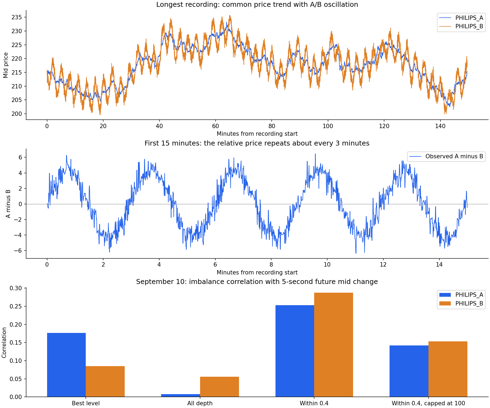

# PHILIPS 价格与公开盘口分析

最清楚的规律是 A/B 价差约 180 秒的周期，以及近端深度对短期价格的预测关系。远端大额档位具有明显的规则性，但不能据此认定对手身份或欺骗意图。A、B 的流动性和成交后价格变化也不同，应分别建模。

**用户补充的身份信息**

用户进一步说明选手单笔委托不超过 200、单股票持仓绝对值不超过 100，并要求采用数量阈值继续分析。已按此口径完成[官方机器人与选手分组分析](PARTICIPANT_REPORT.md)，包括在相同时点比较预测信息、剔除可确认的自身成交，以及持仓约束的解释。

用户确认 GroovyGrapefruits、DiligentDonuts、EarnestEspressos、BrilliantBurritos 为官方机器人，并说明同类命名也是机器人。上述四个名字已保存于 `participant_labels.json`；其他未列明名字先作为待核实候选，不因不在名单中就认定为选手。用户同时说明原始单笔数量大于 200 的是官方机器人，其他大概率为选手。原始订单量、价位聚合量和逐笔成交量不能混为一谈：大档位可以混合多笔订单，小额成交也可以来自官方大单的部分成交。现有文本行情及策略记录没有找到这四个名字，buyer/seller 又全部为空，因此当前不能把历史行为精确归到这些具体机器人。以下身份限制指记录本身的可识别范围，不否定用户提供的身份信息。

已补做严格大于 200 与小于等于 200 的数量分组，见 `participant_split.json`。9 月 10 日，大于 200 的成交记录占 A 的成交量 62.6%、B 的 94.7%；这不是完整的官方成交占比，因为小额撮合记录仍可能涉及官方订单。近端大于 200 档位不平衡与未来 5 秒价格变化的相关系数为 A 0.252、B 0.282，小于等于 200 档位为 A -0.036、B 0.122。两组有效窗口不同，且档位会混合账户，不能把差异直接解释成某类账户的预测能力。

**数据范围与可复核口径**

使用项目 `data/market/` 下全部 14 段录制，日期为 2026-09-09、2026-09-10，录制时长合计约 282.47 分钟。共 65,422 行价格、65,404 条可完整读取的盘口、51,031 笔公开成交。价格行和盘口行各包含一个品种的一次快照，不能解释为独立市场事件。最后记录为北京时间 9 月 10 日 17:18:38，不是实时行情。

9 月 9 日 06:08:02 UTC、9 月 10 日 09:11:54 UTC 开始的两份 gzip 缺少完整流结束标记。保留已完整解码记录，没有补造尾部数据；对应盘口共比价格少 18 行。已核对快照键唯一、价格 CSV 与可读盘口的最优价逐行一致。公开成交按品种、成交时间、成交 ID 去重，未发现重复。

盘口是价格档位聚合，未包含订单 ID 或挂单账户。公开成交的 buyer、seller 全部为空。这里分析的是公开市场整体行为，可能包含自己的订单；没有声称已扣除本账户挂单。约半秒级采样不能识别期间每次新增、撤单、成交，也不能识别真实队列位置。

**1. A/B 相对价格存在稳定的三分钟周期**

用 `D = mid_A - mid_B` 分析相对价格。过滤起点行情要求：两边有报价、买卖价差大于 0 且不超过 2.0、最优档数量小于 15,000、盘口年龄在 -0.5 至 2 秒内；两品种本地观测时间差不超过 0.75 秒。此过滤不是对流动性质量的完整保证，也不代表被排除档位不能成交。

对长度至少 6 分钟的 7 段数据，按时间以前 2/3 拟合、后 1/3 检验。仅在训练段扫描 120—240 秒周期：5 段最优为 180 秒，其余为 179、177 秒。固定 180 秒时，留出段 R² 为 0.823—0.932。这表明规律延续到了后段，而不只是对整段曲线的事后描摹。历史数据可能已参与此前策略研究，因此不称为全新、从未使用过的独立测试集。

拟合形式：`D(t) = c + a sin(2πt/180) + b cos(2πt/180)`。训练段振幅 `sqrt(a²+b²)` 在 9 月 9 日约 4.16—4.38；9 月 10 日各段约 2.99—3.75。均为价格单位，项目采用 0.1 的最小价格档位。9 月 10 日干净快照的 D 的 5%—95% 分位范围约 -3.85 至 +4.00。

这支持用共同价格变化与周期价差分别建模。单凭“B 比 A 贵”并不能确定立即反向交易，仍需判断周期所处位置、预计持有时间与成本。两天的振幅也不应固定成同一数值。

**2. 周期预测期限与进出成本必须匹配**

另外做因果滚动检查：固定已有策略中的 180 秒周期，至少积累 180 秒历史，使用最多 360 秒历史，每约 5 秒重新拟合，只用当时及之前的数据预测。方向定义为模型曲线未来相对当前的变化方向。

下表是按照当时显示的最优价，以 A、B 各 1 股双腿主动进出计算的逐信号平均金额。未来端保留宽价差和大单顶到最优价的行情，不用未来“行情正常”作为筛选条件。

| 预测/持有期限 | 9 月 9 日价差方向准确率 | 9 月 10 日价差方向准确率 | 9 月 9 日报价下平均净额 | 9 月 10 日报价下平均净额 |
|---|---:|---:|---:|---:|
| 5 秒 | 64.3%（2,242 个） | 61.5%（576 个） | -1.123 | -0.630 |
| 15 秒 | 83.9%（2,239 个） | 80.1%（568 个） | -0.192 | +0.140 |
| 45 秒 | 95.3%（2,227 个） | 93.7%（540 个） | +2.270 | +2.094 |

计算为 `预测方向 × 实际价差变化 - (入场A价差+入场B价差+出场A价差+出场B价差)/2`。方向准确率包含价格不变的时点，不变不计作正确。起终点在同一录制段，目标时刻后的观测误差最多 1 秒，不跨越原始观测中超过 2 秒的间隔。

这些是重叠的历史预测窗口，不能把样本数当成独立交易数，也不能将净额相加视作策略利润。未模拟延迟、腿间风险、队列、手续费、并发仓位及止损；未来最优价并非保证成交价。9 月 9 日 45 秒窗口中仍出现单次 -12.3 的报价下损失。结果支持进一步验证 45 秒持有机制，不支持无条件延长持仓。

**3. 远端 20,000 股档位呈现固定规则，但不是可靠的短期买卖压力**

20,000 是两品种最常见的档位数量。按至少 15,000 股定义的大额档位，几乎每个快照都能观察到。9 月 10 日，这类档位占全盘口数量的平均比例约为 A 的 75.7%、B 的 84.4%；其距同侧最优价的中位距离分别为 6.0、8.0，即约 60、80 个 tick。

大额档位在同一价格上连续出现的观测时长中位数，两品种均约 9.52 秒，符合接近 10 秒的更新节奏。这里只追踪“同侧同价仍有大额数量”，不是追踪同一订单；同价撤单重挂无法识别。

推断：市场中可能存在按固定数量、固定距离或定时规则报价的程序。也能看到大量 2,000、2,500、4,000 的常见数量档位。但这不足以判断是官方机器人、哪个团队，或有意诱导交易。

全深度的大量数量位于远端，会把近端买卖差异稀释。更合适的用法是把它们作为极端清算深度和独立参考指标，不直接拿全盘口数量来决定涨跌方向。

**4. 近端深度比全盘口深度更有预测信息，盲目限量也会损失信息**

定义不平衡度 `I = (买盘量-卖盘量)/(买盘量+卖盘量)`。每段每秒保留首个快照，比较它与未来 5 秒中间价变化的相关系数。此描述性检查仅保留起终点都满足上述单品种过滤的窗口，不代表全部行情下的可交易结果。

| 数量取法 | 9 月 9 日 A | 9 月 9 日 B | 9 月 10 日 A | 9 月 10 日 B |
|---|---:|---:|---:|---:|
| 只看最优档 | 0.184 | 0.148 | 0.176 | 0.085 |
| 全盘口 | 0.020 | 0.098 | 0.008 | 0.056 |
| 距同侧最优价 0.4 内 | 0.217 | 0.248 | 0.253 | 0.288 |
| 同上，每档数量封顶 100 | 0.059 | 0.131 | 0.142 | 0.153 |

9 月 10 日，近端 I≥0.6 即近端买量至少为卖量 4 倍时，A 未来 5 秒平均变动 +0.138，B 为 +0.559；I≤-0.6 时分别为 -0.112、-0.606。正负两侧合计强信号样本为 A 1,243、B 988 个，其中价格确实变化时，方向一致率分别为 62.9%、66.5%。这是条件均值和方向关系，不是成交利润或经独立验证的胜率。

这里 0.4 距离和 100 股封顶来自现有配置中的分析假设，没有扫描最优阈值。结果提示：排除远端影响有价值，但把近端 2,000—4,000 股也压成 100 股，可能丢失信息。仍需在新录制数据中验证，再决定是否调整策略。

盘口不平衡作为预测指标有既有研究依据；不同品种的预测效果并不相同。本项目的数值全部由本地记录计算，没有套用文献中的准确率。[Gould 与 Bonart：Queue Imbalance as a One-Tick-Ahead Price Predictor](https://arxiv.org/abs/1512.03492)。

**5. A 的大额主动成交更值得防范，B 的尾部流动性风险更突出**

对公开成交计算主动方的 5 秒后估值变化：主动买入为 `未来mid-成交价`，主动卖出为 `成交价-未来mid`。计时从记录端获知成交开始，目标行情限同段、正常盘口、目标后最多 1 秒；没有断言成交量变化造成后续价格变化。

9 月 10 日 A：至少 1,000 股的大额成交，等权主动方估值变化为 +0.485，数量加权 +0.481，共 94 笔；不超过 100 股的小额成交分别为 -0.208、-0.133，共 10,494 笔。9 月 9 日对应大额成交等权为 +0.601，共 212 笔，同方向关系再次出现。

含义：如果我们恰好作为被动方承接这些 A 大额成交，成交后的价格变化更可能损害这笔被动成交的估值。可以把大额主动成交作为短时调整报价的候选信号，但这些公开成交不是本账户的实际成交收益，94 笔也不足以确定稳定收益。

9 月 10 日 B 的公开成交量为 7,180,870，A 为 626,753，约 11.46 倍。B 至少 1,000 股的成交贡献 74.3% 的量。交易活跃不等于随时有安全退出价格：B 的买卖价差中位数为 0.4，但约 1.81% 快照超过 2.0，最大为 12.0；A 对应中位数为 0.4，超过 2.0 仅约 0.011%。B 第一、第二档间距的 95% 分位为 6.6，A 为 1.0。

在 B 的单侧盘口按显示深度成交 10 股，额外滑点中位数接近 0，但样本最大可达每股 5.76。这是相对最优价的额外滑点，尚未计买卖价差，说明尾部风险比平均深度更值得关注。

**实施优先顺序**

1. 将 A/B 周期用于相对价格预测，并在执行仿真中验证 15—45 秒持有及异常行情处理，不能仅凭拟合好坏扩大仓位。
2. 用近端深度不平衡调整报价，分别评估 A、B；测试距离过滤与数量封顶，保留远端深度用于真实清算估值。
3. 增加自有挂单的可对齐记录，用实际成交检查 A 大额成交后的风险及 B 的深度断层。当前公开快照无法精确分析某个他人的挂单策略。

复现：`python -B analysis/market_review_20260910/analyze.py`。详细指标保存在同目录 `metrics.json`。本次仅生成分析结果，未连接交易所、修改策略或发出订单。
